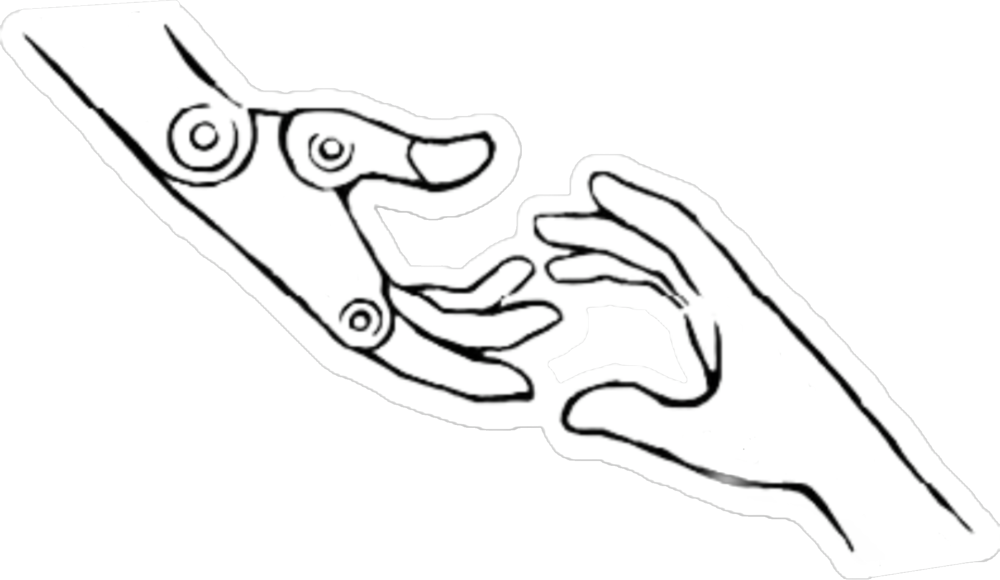

# [Helping hands website](https://www2.ccs.neu.edu/research/helpinghands/)

[](https://www2.ccs.neu.edu/research/helpinghands/)

The helping hands lab website is now successfully deployed [here](https://www2.ccs.neu.edu/research/helpinghands/) on Khoury NEU server!
The previous preview version on Netlify.app is still available [here.](https://helpinghandslab.netlify.app/)
* **As our website is newly launched, to avoid website collapse, please create your own branch for modification, and then make a pull request.:) Sorry for the inconvience. I will frequently check and examine the request. **
  * tips: you can find a preview link in your github request page in 2 minutes after pulling a request, if no errors in your files. If it shows 'fail to preview', you can use error logs for debugging. :)
  * tips: If you would like to use the above method to debug, pls contain "testing" in your request topic so that I won't merge it.
  * tips: If you would like to preview the modification, pls follow [this instruction](https://wowchemy.com/docs/getting-started/install-hugo-extended/)

* It often need about 5 min for website to update after merging. 

* Please only do add/modify/delete actions in the *content* folder. :)

## Publication
* **Add publication**: 

  Create a folder, e.g. '/content/publication/$YOURNAME_PAPERNAME', copy a template index.md and cite.bib from '/content/publication/my_conference_paper' folder and modify it. You can save a feature picture as 'featured.jpg' (or 'featured.jpg') in your folder.

  
* **Change publication category**: 
  
  Modify publication_types in '/content/authors/$YOURNAME_PAPERNAME/index.md'
* **Modify your own page**

  Modify in '/content/authors/$YOURNAME_PAPERNAME/_index.md'
* **Redirect it to your personal project website**: find your folder and append the following in '/content/authors/$YOURNAME_PAPERNAME/index.md'. Substitude 'yourURL'.
    ```
    <meta http-equiv = "refresh" content = " 0 ; url = yourURL"/>
    ```
    * tips: Please link to the PDF. Use the url option in the header of index.md to add buttons such as 'project, PDF, Video'
* **Internal link**

  If you want to link to some files in your folder, the path should be like '/publication/$YOURNAME_PAPERNAME/$FILENAME'

## People
* **Add people**: 

  Create a folder, e.g. '/content/authors/$YOURNAME', copy a _index.md from other's folder and modify it. Your avatar must be saved as 'avatar.jpg' in your folder.
* **Change people category**: 
  
  Modify user group in '/content/authors/$YOURNAME/_index.md'
* **Modify your own page**

  Modify in '/content/authors/$YOURNAME/_index.md'. **And I strongly suggest you modify the social info in your own profile.** It is in '/content/authors/$YOURNAME/_index.md'. 
* **Redirect it to your personal website**: find your folder and append the following in '/content/authors/$YOURNAME/_index.md'
    ```
    <meta http-equiv = "refresh" content = " 0 ; url = yourURL"/>
    ```

## Home page and News
* **About**

  Modify in '/content/author/admin/_index.md'.
* **Add/modify news**

  In /content/home/news.md.

## Advanced option for website layout

* **To add/delete widgets on home page**

  Add/delete a markdown file in /content/home. You can change the order of widgets by adjusting 'weight'. 
  More instructions are [here.](https://wowchemy.com/docs/getting-started/get-started/#themes)

## Advanced option for real-time preview & debugging
[Offcial document](https://wowchemy.com/docs/getting-started/install-hugo-extended/)

## Debugging tips:
* Building: YAML, mapping values are not allowed in this context
  1. One space after "KEY:" in yaml or your index.md
  2. Enclose your content in quotation marks after "KEY:" in yaml or your index.md, espectially when your content contains colons (":").

## To-do list
* Link news section to lab twitter account

## Website major updates
* Mar 25, 2022: Automatic deployment after new pr or commit.
* Mar 20, 2022: Our website finally successfully deployed on Khoury server!
* Mar 12, 2022: paper tile directly link to pdf page, by Dian
* Mar 9, 2022: people directly link to personal page, by Dian
* Mar 9, 2022: add side feature pic on publication page, by Dian
* Mar 3, 2022: Support dark mode! by Mingxi
* Mar 2, 2022: HH website launched! by Mingxi
