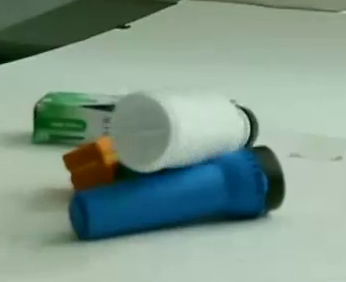
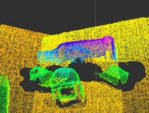

#GPD (Grasp Pose Detection), v1.0.0, released 5/2017:

**What it does:** Take a point cloud as input. Produce the 6-dof position and orientation of grasps as output. Takes a few seconds per point cloud to detect grasps (on our desktops).

Scene            |  Input Point Cloud           |Detected Grasps
:-------------------------:|:-------------------------: |:---------------------:
  |    |  

**Requirements: (hardware)** Computer with at least one Nvidia GPU, some kind of RGBD camera (Microsoft Kinect, Asus Xtion Pro, Carmine, Structure.IO, etc); (software) Ubuntu 14.04, PCL 1.7 or later, Eigen 3.0 or later, ROS Indigo, CAFFE.

**Link to package**: [Link](https://github.com/atenpas/gpd)

How to install/use it (more detailed instructions here):
1. Make sure you have PCL 1.7 (or later) and Eigen 3.0 (or later) installed
2. Install [CAFFE](http://caffe.berkeleyvision.org/). Make sure you install the version that worked with Boost 1.54 (see instructions)
3. Install [ROS Indigo](http://wiki.ros.org/indigo)
4. Clone, make, and install https://github.com/atenpas/gpg.git
5. Clone, catkin_make https://github.com/atenpas/gpd.git
6. Connect an RGBD camera to your robot/computer.
7. Start the driver for your RGBD camera: roslaunch openni2_launch openni2.launch
8. Start rviz: rosrun rviz rviz
9. In rviz, load the config file gpd/tutorials/openni2.rviz.
10. Launch the ROS node that detects grasps: roslaunch gpd tutorial1.launch
11. Read grasps from ROS topic /detect_grasps/grasps

**Proviso regarding the input point cloud:** GPD performance is affected by the quality and completeness of the point cloud you provide. The software will work reasonably well with a point cloud created using a single depth sensor snapshot. However, it works better if you provide a point cloud created by registering together point clouds taken from two or more perspectives (see the discussion on "views" on the git readme). Going from one view to two views increased our grasp success rates by 9%. You can create such a "two-view" point cloud by mounting two depth sensors to your robot instead of just one (see pic to the right), or mounting a single depth sensor on the end of the arm and moving it to two different perspectives.

**Proviso regarding object detection:** For most applications, you will need to combine GPD with an object detection strategy. By itself, GPD detects grasps everywhere -- on just about any object within sight of the sensor. You need to detect the approximate location of the object so that you can discard the detected grasps that are not on that object. Here are some suggestions: 1) segment out the table in the point cloud using RANSAC, cluster the points belonging to objects above the table, pick one of these "clusters" to be the object you want to pick up (perhaps the closest one; perhaps use a color histogram to choose one); 2) use an object detector such as RCNN or you can just use the BVLC Reference network to classify bounding boxes you create around each of the detected grasps (here, you would be limited to detecting objects that are well represented in ImageNet); 3) fine-tune your own deep network to detect the specific objects you have in the lab.

<iframe  title="YouTube video player" width="720" height="400" src="https://www.youtube.com/embed/kfe5bNt35ZI" frameborder="0" allowfullscreen></iframe>

* Gualtieri, M., Ten Pas, A., Saenko, K., Platt, R., [High precision grasp pose detection in dense clutter](http://arxiv.org/abs/1603.01564), IROS 2016. Journal version preprint [available here](https://www2.ccs.neu.edu/research/helpinghands/papers/journal_preprint_2017.pdf).